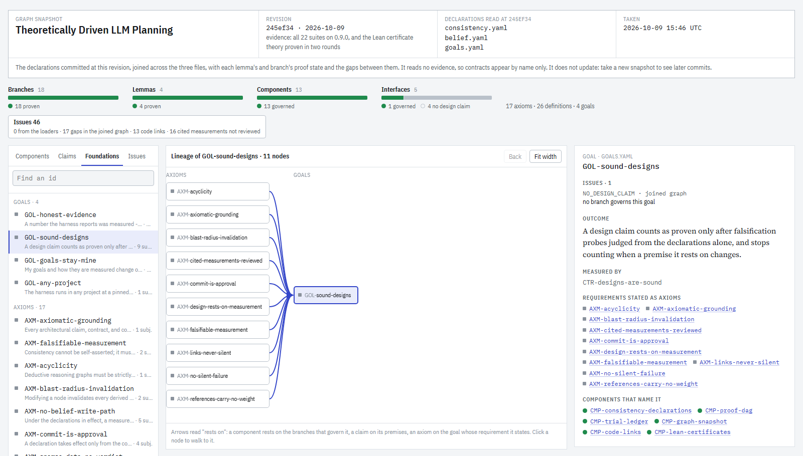

# Theoretically Driven LLM Planning (TDLP)

**Make your AI coding agent prove it.**

TDLP is a Claude Code plugin that turns an agent's work into a verifiable engineering process. You
set the goals. The agent designs, builds and tests on its own, and nothing it *says* counts: a
result exists only once a tool has measured it, and a design holds only once it has survived
attempts to refute it.

<picture>
  <source media="(prefers-color-scheme: dark)" srcset="docs/assets/goal-snapshot-dark.png">
  
</picture>

<sub>**This repository, drawn by its own plugin.** An AI agent built TDLP under TDLP, so the repo is
its own demo. The picture is a goal snapshot, `snapshot(focus="GOL-sound-designs")`, taken at
`245ef34` (v0.9.0, 2026-10-09): every design claim proven, every component covered by a design,
and on the left the ten requirements one of its four goals rests on. A snapshot names its commit
and does not update; take one yourself in the [tour](#try-it-in-five-minutes).</sub>

---

## Why it's different

### 1. Verifiable: the agent can't grade its own homework

* **No tool writes a result.** There is no `set_belief` and no `mark_proven`. Evidence comes from
  tests the server runs itself (capturing the output, its hash, and the exact file contents it ran
  on) or from falsification probes recorded by a verifier that cannot open a file. What the agent
  merely asserts is recorded with zero weight.
* **Results expire with the code.** A result stops counting the moment a file it measured changes.
  It stays on record and is marked *stale*; it is not counted until re-run.
* **"Not enough data" is an answer.** Sparse evidence reads `insufficient`, never a pass.
* **Your goals stay yours.** A git hook refuses the agent's commits to `goals.yaml` and the tests
  that measure it. The agent may change everything below your goals, not what they mean.

What that looks like, from this repo's own tools:

```text
status(view="goals")
GOL-sound-designs  MET -- A design claim counts as proven only after falsification probes judged from ...
  CTR-designs-are-sound [unbucketed] supported gate 5/5 passed in RUN-0302 (+65 stale)

status(view="tree")
basis: verification_trials×69 set=8b3c8d · proven=22 obligations=0 refuted=0
```

`RUN-0302` is the run the verdict rests on. `+65 stale` counts older results kept on record that no
longer count, because what they measured has changed since.

### 2. Systems-engineered: a V-model, with you at the top

Every stage of the classic V has a home, and each is checked by something other than the agent's
word. Your part is the top row. The agent owns the rest.

| Stage | Declared | Checked by | This repo at `245ef34` |
|---|---|---|---|
| **Needs** (yours) | goals, and the interfaces between them, in `goals.yaml` | acceptance tests the agent may not edit | 4 goals, 1 interface: **5/5 met** |
| **Requirements** | axioms and definitions, each axiom naming the goal it serves | every design claim must trace back to them | 17 axioms, 26 definitions, every axiom traced to a goal |
| **Architecture** | components and the interfaces between them, in `belief.yaml` | interface tests | 13 components, 4 interfaces: **4/4 supported** |
| **Design** | lemmas and design decisions, each argued from the requirements | refutation attempts by an independent verifier | 22 claims: **22/22 proven**, 0 refuted |
| **Build and test** | the files each component owns | component tests, run by the server | 13 contracts: **13/13 supported**, 455 cases |
| **Configuration control** | declarations read from the committed revision only | each result stamped with the file contents it ran on | uncommitted edits change no verdict |

It is traced end to end. A design decision names the component it governs and cites the test
contract that measures it, so any change can be walked from a file, through components,
contracts and design claims, to the goals it puts at risk.

### 3. Sticky: a loop the agent keeps running on its own

Each server ships its loop in the instructions Claude Code loads with its tools, and every answer
names the next call. So the agent doesn't stop at "looks done". It diagnoses, runs, re-checks, and
stops only when a policy is met or a decision is yours.

```text
does it work?            status(view="diagnose") → run_test(...)    → status(view="belief")
does the design follow?  status(view="probe")    → verify_step(...) → status(view="tree")
what did my change hit?  git commit              → impact(...)      → "next: run_test TST-..."
am I done?               decide(policy)          → adopt, or more_testing with the shortfall named
```

No test is dropped without a reason. From this repo's `status(view="plan")`:

```text
mandatory (scheduled regardless of information gain):
  - TST-server (e2e, cost 1.0)
  - TST-consistency-server (e2e, cost 1.0)

skipped (every test considered, with its reason):
  - TST-acceptance-designs: not_decision_relevant — policy verdict is identical at both ends of the interval
  ...
```

You check in with a single call, `status(view="goals")`. Approval happens once, when you commit a
goal, not at every step.

---

## What's in the box

One plugin, `tdlp`, with four MCP servers, two workflow skills and a verifier subagent:

| Server | Answers | In plain words |
|---|---|---|
| **component-belief** | Does it work? | runs the declared tests itself and keeps score per contract |
| **consistency-belief** | Does the design follow? | checks that each design decision follows from the stated requirements |
| **stamp-monitor** | Is the evidence still current? | traces what a change touched, and flags tampering and skipped steps |
| **graph-snapshot** | What does the whole design look like? | draws goals, requirements, claims and components as one page (the picture above) |

---

## Try it in five minutes

The quickest way to see it is this repository, which declares itself. You need
[Claude Code](https://claude.com/claude-code), `git` and [`uv`](https://docs.astral.sh/uv/).

```bash
claude plugin marketplace add davechendatascience/Theoretically_Driven_LLM_Planning
git clone https://github.com/davechendatascience/Theoretically_Driven_LLM_Planning
cd Theoretically_Driven_LLM_Planning
claude plugin install tdlp@davechendatascience-marketplace --scope project
claude
```

The first start builds the four servers and can take a minute or two. This repo's
`.claude/settings.json` already raises the connect timeout to allow for it. Then ask in plain
words, and the agent picks the tools:

| Ask Claude | You get | Tool behind it |
|---|---|---|
| "Are this repo's goals met?" | each goal met, not met, insufficient or stale, with the run that says so | `status(view="goals")` |
| "Take a goal snapshot of GOL-sound-designs." | `.graph-snapshot/snapshot.html`, the page at the top of this README; open it in a browser and click around | `snapshot(focus=...)` |
| "Why is BRN-goal-guard proven?" | its proof tree, down to the requirements it rests on | `status(view="tree", subject=...)` |
| "What did the v0.9.0 release touch?" | changed files, then components, contracts, design claims and policies | `impact(base="4463d1c~1")` |
| "What should be tested next?" | this round's tests, and why every other test was skipped | `status(view="plan")` |

**Then break something**, to watch evidence expire:

1. `git switch -c try-it`, add a comment line to `src/component_belief/goals.py`, and
   `git commit -am "try it"`.
2. Ask again whether the goals are met. `GOL-goals-stay-mine` now reads `STALE`: that file belongs
   to the component serving the goal, and the evidence was measured on its old contents.
3. Before anything re-runs, `git switch main` and ask once more. The goal reads met again, with no
   re-run, because evidence is bound to file contents, not to time.

To let the agent re-run this repo's own tests, give the clone an environment first:
`uv sync --extra dev`.

## Use it on your project

```bash
cd /path/to/your/project
claude plugin install tdlp@davechendatascience-marketplace --scope project   # commit .claude/settings.json
```

Add `"env": {"MCP_TIMEOUT": "120000"}` beside `enabledPlugins` in that settings file, then start
Claude Code and run **`/tdlp:adopt-goals`**. The agent reads what your project already tests,
drafts a `goals.yaml` for you, and stops. You review it and commit it yourself. From there:

* the agent declares components and design decisions as it works, and runs the loops on its own;
* `status(view="goals")` is your check-in;
* changing a goal is a commit only you make.

Setup details, moving an older install, and running from source are in the
[guide](docs/guide.md#quick-start).

---

## The vocabulary, in plain words

TDLP borrows its terms from proof assistants and systems engineering. Each id prefix names a kind
of thing:

| Term | Plain meaning |
|---|---|
| **goal** (`GOL-`) | an outcome you want, and the test that says it's achieved; yours alone |
| **component** (`CMP-`) | a part of the system, and the files it owns |
| **interface** (`IFC-`) | what one part hands to another, and the check the hand-over must pass |
| **contract** (`CTR-`) | the pass rule a part's test results must meet. A *gate* means every case passes; a *rate* means it passes often enough, with a confidence interval |
| **axiom** (`AXM-`) | a requirement, stated as a premise every design argument must trace back to |
| **definition** (`DEF-`) | a term the requirements use, pinned down |
| **lemma** (`LMA-`) / **branch** (`BRN-`) | an intermediate claim / a design decision, both argued from axioms. A branch governs a component and cites the contract that measures it |
| **probe**, **trial** | one attempt to refute a claim: look for a counterexample, check the conclusion follows, check its negation |
| **proven / doubted / refuted** | survived enough independent attempts / a gap was found / a counterexample was found |
| **obligation**, **conditional** | not yet checked enough / checked, but resting on a step that isn't |
| **evidence**, **ledger** | one recorded test case or trial / the append-only log of all of them (`.belief/`, `.consistency/`), committed to git |
| **stamp**, **stale** | the fingerprint of the exact files a result was measured on / a result whose files have changed since: kept, not counted |
| **insufficient** | too little data for a verdict, reported as such |
| **policy**, **decide** | the release criteria / the call that checks them and records the decision |

---

## Learn more

* **[The guide](docs/guide.md)**: the full manual. Principles, every tool of every server, how
  the two ledgers join, the systems-engineering mapping, the layout and the test suites.
* **[CHANGELOG.md](CHANGELOG.md)**: release notes, newest first.
* Design notes: [consistency rules](docs/consistency_belief_mcp_design_rules.md) ·
  [component rules](docs/component_belief_mcp_design_rules.md) ·
  [component model](docs/component_belief_mcp_design.md) ·
  [stamp monitor](docs/stamp_monitor_mcp_design.md) ·
  [graph snapshot](docs/graph_snapshot_mcp_design.md) ·
  [code-to-theory tagging](docs/code_to_theory_tagging_design.md)
* This repo's own declarations, for a worked example: [`goals.yaml`](goals.yaml),
  [`consistency.yaml`](consistency.yaml), [`belief.yaml`](belief.yaml).
